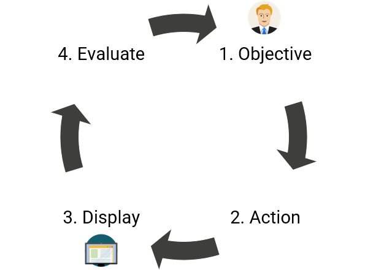
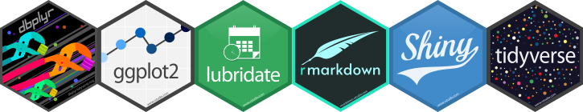
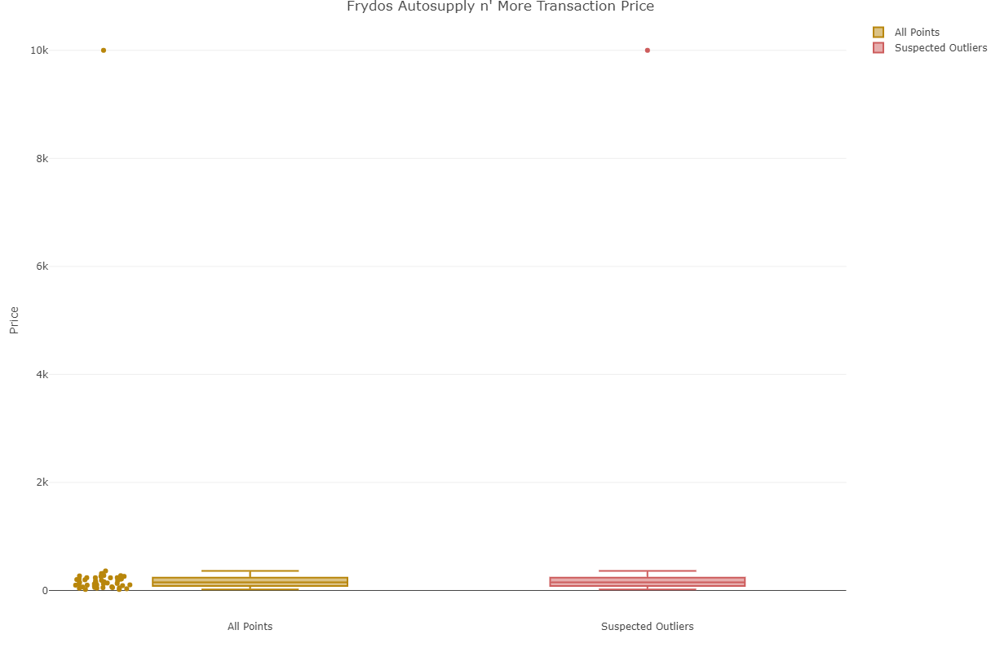
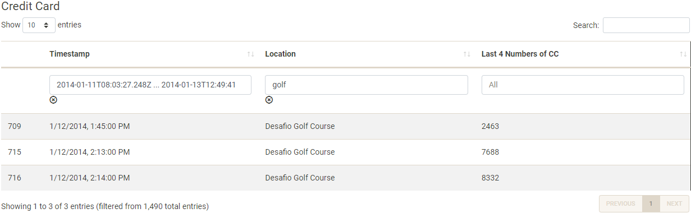

<style>
p.caption {
  font-size: 0.6em;
}
</style>

```{r setup, include=FALSE}
knitr::opts_chunk$set(echo = FALSE, strip.white=TRUE)
library(knitr)
library(png)
library(grid)
library(dplyr)
```

# Objective

To use interactive visual analytic techniques on financial and movement data to assist law enforcement with their investigation into the mysterious disappearance of several GAStech employees.

Using interactivity, we're able to bring together disparate data together to extract insights such as linking location with transaction information to identify credit card owners or mapping unofficial relationships using transaction patterns.

# Approach

We apply a simplified interactive design and drill down framework - see Figure 1. With our users' objectives in mind, we structure our application to start at a high-level aggregation. From there, we incorporate the following interactive dynamics: navigating, filtering and sorting, selecting, and sharing annotations to enable the user to drill down to more granular levels of detail.
```{r framework, echo=FALSE, fig.align='center', fig.show='hold', out.width='30%', fig.cap='Left: Interaction Framework. Right: Drill Down Framework.'}

knitr::include_graphics("img/poster/drilldown_framework.png")
```

In addition to the packages in Figure 2, we use several geospatial R packages for handling the movement data: sf, raster, and tmap. We also use visNetwork and collapsibleTree for visualising networks. For interactivity, Plotly is invaluable especially given its compatibility with ggplot.
```{r hex, echo=FALSE, fig.align='center', fig.cap='R Packages'}

```

# Results

#### Spending

The bar chart in Figure 3 shows the number of transactions at each location. Selecting a bar from the chart generates a box plot that enables a drill down into anomalous transactions at that location.

```{r results-spending-1, echo=FALSE, fig.align='center', fig.show='hold', out.width='70%', fig.cap='Top: Bar Chart of Number of Transactions by Location., Bottom: Box plot of Transactions at Selected Location.'}
knitr::include_graphics("img/poster/bar.png")

```

#### Patterns of Life

Figure 4 is a visualisation of vehicle paths and points of interest (POI). Clicking on a POI surfaces a tooltip that surfaces details such as duration of stay at the POI.

```{r results-geo-1, echo=FALSE, fig.align='center', out.width='100%', fig.cap='Car ID 28 Vehicle Path on 2014-01-06 Shows Irregularities'}
knitr::include_graphics("img/poster/paths_map.png")
```

Figures 5 and 6 bring together financial and movement data. Through the use of filtering and selecting, it is possible to identify the owner of a credit card by narrowing down who was at a given location when a credit card transaction was made.

```{r results-geo-2-1, echo=FALSE, fig.align='center', fig.show='hold', out.width='100%', fig.cap='Table of Credit Card Transactions Filtered for 2014-01-12 and Desafio Golf Course'}

```

```{r results-geo-2-2, echo=FALSE, fig.align='center', fig.show='hold', out.width='100%', fig.cap='Top image: POIs on 2014-01-14. The POIs closest to the Desafio Golf Course are selected. Bottom image: The details of the selected POIs in tabular format.'}
poi_images <- c("img/poster/pois_map_only.png", "img/poster/pois_map_table.png")
knitr::include_graphics(poi_images)
```

#### Relationship Networks

Figure 7 visualises the official relationships of GASTech employees using Collapsible Tree and an interactive data table.

```{r results-network-1, echo=FALSE, fig.align='center', fig.show='hold', out.width='80%', fig.cap='Top: Tree Visualisation of GASTechs Engineering Drill Technician Department. Bottom: Table Rendering of the Tree.'}
official_network_images <- c("img/poster/official_relationships_network.png", "img/poster/official_relationships_table.png")
knitr::include_graphics(official_network_images)
```

Figure 8 is an interactive network of transaction data, which has been enriched by credit card ownership mapping generated from the 'Patterns of Life Kinematics' module

```{r results-network-2, echo=FALSE, fig.align='center', fig.show='hold', out.width='80%', fig.cap='Left: Network for transactions made at Chostus Hotel. Right: The details of the transactions from Chostus Hotel.'}
unofficial_network_images <- c("img/poster/unofficial_relationships_network.png", "img/poster/unofficial_relationships_table.png")
knitr::include_graphics(unofficial_network_images)
```

# Future Work

1. Employee-to-employee network graph using movement data to capture relationships that do not involve transaction data.

2. Network graph of credit card and loyalty cards to visually identify mappings that deviate from 1 credit card to 1 loyalty card. For example, 1 credit card to multiple loyalty cards.

```{r echo=FALSE, eval=FALSE}
library(pagedown)
pagedown::chrome_print("VAposter.html")
```