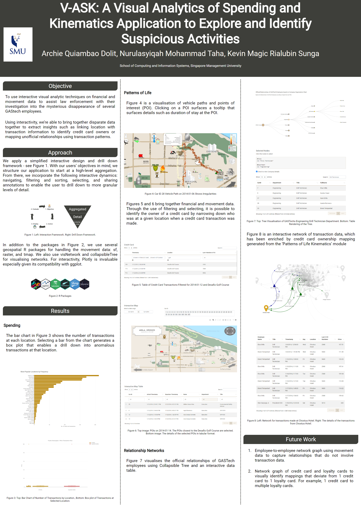

```{r setup, include=FALSE}

set.seed(1234)

knitr::opts_chunk$set(
	eval = TRUE,
	echo = TRUE,
	fig.retina = 3,
	message = FALSE,
	warning = FALSE
)
```

```{r, include=TRUE, fig.align="center", echo=FALSE, out.width='100%'}

```