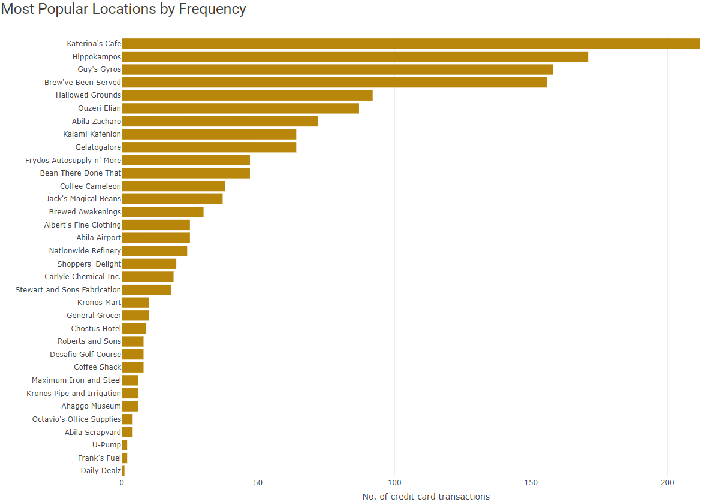
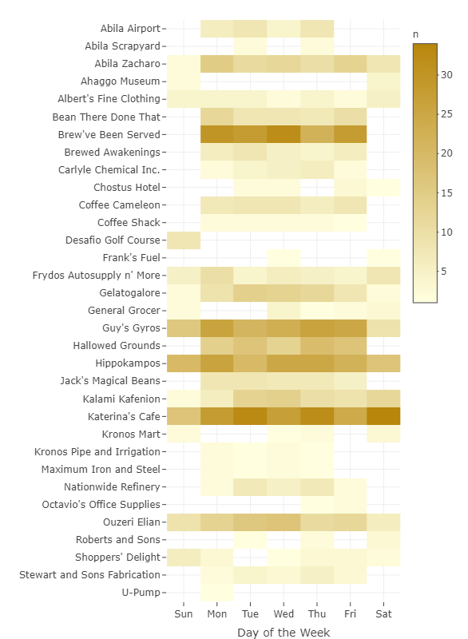
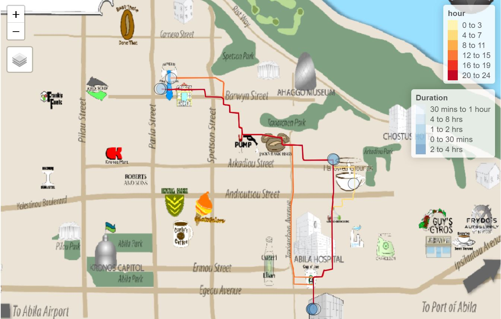
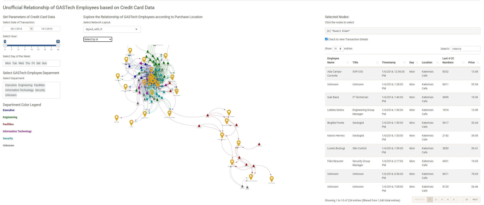

# Introduction 
VAST Challenge 2021 – The Kronos Incident (Mini-Challenge 2) presents a mystery on the fictional island country of Kronos where several employees of GASTech, a Tethys gas multinational, went missing between 20 and 21 Jan 2014. Law enforcement has sought assistance with their investigation into the disappearance. GASTech had provided the following data that covered two weeks prior to its employees’ disappearance: (a) GASTech employee’s credit card transactions and Kronos Kares loyalty card data, and (b) movement and tracking data from GASTech’s company vehicles which have GPS tracking.

In the real world, we can reasonably expect law enforcement’s investigations into crime and suspicious activities to involve, at the very least, an analysis of transactional and movement data. Therefore, we endeavoured to use visual analytical techniques to surface anomalies and suspicious activities from the fictional GASTech datasets by building a web-enabled analytical tool, the “Visual Analytics of Spending and Kinematics (V-ASK)” application. Ultimately, this tool could be used by real world law enforcement if their investigation involves transactional and movement data, and interactions between both datasets.

This paper reports on our work designing, building and deploying a web-enabled client-based analytical tool to support law enforcement’s exploration and analysis of both transactional data and movement data, within six sections. Section 1 provides the background and general introduction of this paper, while section 2 shares the motivation and objective of our work. Section 3 reviews past work and highlights our sources of inspiration, e.g. “Points of Interest” concept, as well as summarises the R packages used to building our interactive application. Section 4 details our user interface design process and section 5 highlights key insights drawn from using our application. Finally, section 6 concludes with possible future work to build on the present work.

# Motivation and Objectives
Our research work was originally motivated by the desire to simply fulfil the course requirements of *ISSS608 – Visual Analytics and Applications* as part of Singapore Management University’s Master of IT in Business programme. In reviewing past work, we found that past submissions to solve Mini-Challenge 2 relied on proprietary software which made reproducibility by the public difficult.

Therefore, the objective of our research was to develop a user-friendly visual analytical tool, V-ASK app, to (a) explore transactional data, (b) understand movement data, (c) identify owners of financial cards, (d) discern informal relationships, and (e) identify anomalies and suspicious activities. We deploy V-ASK to the R Shinyapps.io platform, such that law enforcement officers may perform analytical tasks by toggling various widgets without requiring any coding or programming knowledge.

# Review of past works and R packages
As VAST Challenge 2021 is a redux of VAST Challenge 2014 with some variation, modified data and new questions, we reviewed past submissions for Mini-Challenge 2 for some inspiration on tackling this year’s challenge.

We were particularly drawn to the submission by DAC-MC2 team from Virginia Tech. They used a methodology called Points of Interest (“POI”) to identify POIs such as people’s homes, their workplaces, and recreational locations (e.g. restaurants, cafes). A location is considered a POI if the time spent at a location is more than 5 minutes and the location has a diameter of less than 50 meters. They then graphed the distribution of POI over time for various days (weekdays and weekends) and locations (i.e. home, work, recreation).

All previous submissions lacked interactivity and most of them had relied on proprietary softwares. Therefore, we sought to use an open-source platform, R, so that our app is reproducible and accessible. We also explored various R packages to enable us to build an interactive R Shiny App for exploration and analysis of transactional data and movement data. We downloaded the following packages from CRAN for the respective tasks:

* Load and prepare data: ‘tidyverse’, ‘DT’, ‘profvis’
* Work with time and date data: ‘clock’, ‘lubridate’
* Plot graphs and visualisations: ‘ggplot2’, ‘ggforce’
* Add interactivity to visualisations: ‘plotly’, ‘ggiraph’
* Load maps and manipulate geo-spatial data: ‘rgdal’, ‘tmap’, ‘sf’, ‘raster’
* Create collapsible tree diagrams: ‘collapsibleTree’
* Plot interactive network graphs: ‘igraph’, ‘ggraph’, ‘visNetwork’
* Build Shiny app and associated customisations: ‘shiny’, ‘shinythemes’, ‘shinyWidgets’

# User interface design
Before we begin to design our analytical tool, we looked at the nature of datasets provided under Mini-Challenge 2: (a) credit card transactions of GASTech employees by date-hour-minute and without identifying card owner, (b) Kronos Kares loyalty card transactions of GASTech employees by date only and without identifying card owner, (c) GPS tracking of GASTech company cars and trucks, and (d) GASTech assignment of employees to company cars and their job designation/department.

The Mini-Challenge also provided a tourist map of fictional Abila, Kronos, where GASTech is based. As the map image file provided (MC2-tourist.jpg) does not have coordinates projection, we had to perform geo-referencing. We used a geographic information system software, QGIS, to geo-reference the image file with the Abila shapefile (in WGS84 coordinates) to obtain a geo-referenced tourist map (MC2-tourist.tif).

Therefore, we designed our analytical tool with the following general approach: (i) to explore and draw insights from each dataset separately, and (ii) to explore and draw insights from combined datasets. At each level, the user will be provided with (i) a visual overview of the data, (ii) the option of interactive widgets to drill down to more detailed information, and (iii) tooltips or table for the lowest level information. To incorporate these approaches, the V-ASK App is arranged in R Shiny using navigation bars and tab panels as follows:

* Home – Overview of V-ASK and user guide
* Spending EDA – Separate tabs for exploratory data analytics for each transactional data, ‘Credit Card Data’ and ‘Loyalty Card Data’, and a tab for combined dataset.
* Patterns of Life Kinematics – ‘GPS Movement’, ‘Owners Identification’, the ‘Credit card and loyalty card matching’ tab will not be available for use by real life law enforcement
* Relationship Networks – ‘Organisational chart of GASTech’, ‘Spending habits’
* Insights – Showcase of anomalies and suspicious activities (this tab will not be available for use by real life law enforcement)

**‘Spending EDA’ module**

Under the ‘Credit Card Data’ tab, we first display an overview barchart of ‘Most Popular Locations by Frequency’ of credit card transactions. The tooltip of each bar will indicate the number of credit card transactions that took place at each location.

To find out the credit card use over the period of two weeks at a certain location, the user may click on the bar for a location to generate a heatmap: ‘Credit Card by Location’. The tooltip of each tile in the heatmap will reflect the value of transactions made with a credit card at the selected location on the specified date. It would be atypical for a credit card to be used to make more than two transactions on the same day at the same location and such instances should be investigated further. When the user clicks on a bar in the bar chart, a boxplot ‘Transaction values by location” will be generated to identify any outlier transactions.

In this ‘Credit Card Data’ tab, the user may also explore the ‘Most Popular Locations by Hours of the Day’ heatmap, based on the cumulative period of two weeks. The user may filter the heatmap by date to understand the daily popularity of a location by hours of the day. When the user clicks on a tile, the ‘Credit Cards by Location’ heatmap and ‘Transaction values by location’ will be similarly updated to reflect this selection.

The ‘Loyalty Card Data’ tab enables the user to explore loyalty card data in a similar fashion. A key difference would be the heatmap ‘Most Popular Locations by Day of the Week’ as the loyalty card data timestamp is by date only. Also, the boxplot ‘Suspected Outliers for All Locations’ displays an overview of all loyalty card transactions, therefore providing a different perspective on identifying outlier transactions.

As there is no one-to-one matching of credit card and loyalty card transactions, ‘Credit Card + Loyalty Card’ tab provides a quick overview of credit card transactions without a corresponding record in the loyalty card dataset, vice-versa, with the tooltip detailing the value of transaction.

**‘Patterns of Life Kinematics’ module**

Under the ‘GPS Movement’ tab, we first display an overview path of Car ID 1 over two weeks, as well as its POIs. The vehicle path, which traces the movement is colour-coded by the hour of the GPS coordinates to clearly highlight travel by various times of the day. The POIs, which represents stationary periods of a vehicle, are colour-coded by time spent at a POI. The most translucent blue reflects the vehicle being stationary for less than 1 hour, while the most opaque blue reflects the vehicle being stationary for more than eight hours. Using these visualisation techniques, we can clearly show where any individual goes, at what time and for how long.

The user may refine the exploration of vehicle movement by toggling the following options: Car ID (multiple vehicles may be selected), dates (either a single date or consecutive dates), and time intervals within a day. Extensive exploration will reveal the likely places of residence, workplace and other regularly visited POIs for the GASTech employee assigned to each company car and possible suspicious activities.

The ‘Owners Identification’ tab allows the user to use both credit card data and movement data to infer likely owners of the credit card and loyalty cards. Firstly, the user may refer to the overview heatmap ‘Credit Card Spending Behaviour’ to select a credit card of interest. The credit card number of interest is keyed into the table to generate the list of all transactions made with that card.

Next, the user should choose a transaction timestamp from the list and adjust the date range for the interactive map. The ‘lasso select’ tool should be used to select the approximate POI area on the interactive map. The interactive map table will list all vehicle IDs and name of GASTech employee (for assigned company cars only) that stopped at the POI area.

At the same time, the user should key in the credit card number of interest into the credit card-loyalty card matching table to find the most likely loyalty card connected to a credit card by virtue of its common owner. Our extensive exploration generated the list of matched loyalty cards, credit cards, cards’ common owner and assigned Car ID in the ‘Credit Card and Loyalty Card Matching’ tab.

**‘Relationship Networks’ module**

In the ‘Organisational Network’ tab, we first display GASTech’s organisational chart at the department level as an overview. User may click on each ‘department’ node to expand the tree into the job titles held within the department. Clicking on the ‘title’ node would expand the tree into the specific employee names. Each time a node is expanded, the data table will be updated to reflect the full detail of the GASTech employee name, assigned Car ID, department and job title.

In the ‘Spending Habits’ tab, we first display the network graph of GASTech employees visiting and transacting at various locations over the two-week period. The user must toggle with the following to focus on a specific sub-graph of the otherwise complicated overview graph and perform any meaningful analysis to identify unofficial relationships between GASTech employees: date of transaction (single date or consecutive dates), time interval of the day (e.g. lunch time, night time), day(s) of the week and (multiple) departments. The user may also explore by clicking on ‘location’ nodes to review which employees across departments gather at common times, suggesting the formation of unofficial relationships.

# Key insights
Cross-exploration of the tabs in the V-ASK app is limitless. We share some key insights from our exploration.

**‘Spending EDA’**

Based on a combination of various visualisations under the ‘Spending EDA’ tab, we found that *Katerina’s Café* is popular throughout the week with the bulk of their customers transacting during lunch and dinner.

*Frydos Autosupply n’ More* reported an outlier transaction of \$10,000 on 13 Jan 2014, since their transactions typically range between \$83 to $236. Further investigation should be performed on this transaction.

**‘Patterns of Life Kinematics’**

From the ‘GPS Movement’ tab, we can generally identify the normal place of residence for employees assigned with a company car if we set the time interval from 9.00pm to 12.00am and refer to the POI location.

**‘Relationship Networks’**

Based on the interactive network of transactions graph, we observe that the truck drivers tend to form a community of their own, separate from the rest of the GASTech employees. This could largely be due to the nature of their work that involves driving to far locations such as *Abila Airport*.

From the same graph, we also found unexpected relations at the Chostus Hotel during office hours, which warrant further investigation.

**Suspects**

Upon exploring all three modules of V-ASK App, we shortlist the following individuals as suspects responsible for the disappearance of their GASTech colleagues: Isia Vann, Hennie Osvaldo, Hideki Cocinaro and Bertrand Ovan. Coincidentally, three of them are from the Security department, except for Bertrand Ovan.

# Conclusion
The exploration of the V-ASK App demonstrates that the feasibility of using visual analytics techniques to analyse transaction data and movement data. Further, movement data can complement transaction data through network graphs to gain further insights.

V-ASK App has room for further enhancements. For example, we can plot employee-to-employee network graphs across various time periods to incorporate the element of time and generate spatial movement networks. We can also plot a network graph of credit card and loyalty cards to visually identify mappings that deviate from one credit card to one loyalty card.

