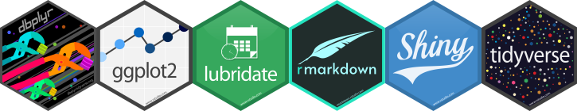
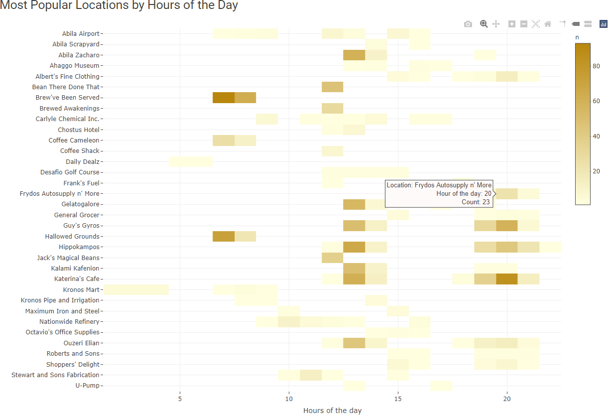
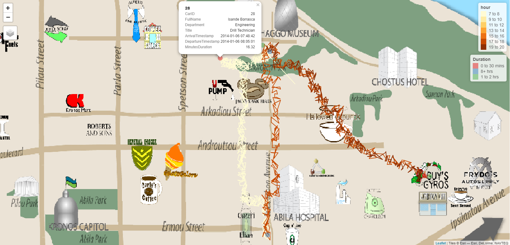

<style>
p.caption {
  font-size: 0.6em;
}
</style>

```{r setup, include=FALSE}
knitr::opts_chunk$set(echo = FALSE)
library(knitr)
```

# Objective

To use interactive visual analytic techniques on financial and movement data to assist law enforcement with their investigation into the mysterious disappearance of several GAStech employees.

Using interactivity, we're able to bring together disparate data together to extract insights such as linking location with transaction information to identify credit card owners or mapping unofficial relationships using transaction patterns.

# Approach

We apply a simplified interactive design framework - see Figure 1. With our users' objectives in mind, we incorporate the following interactive dynamics: navigating, filtering and sorting, and selecting. After the user takes any one of these actions, the data is displayed for evaluation.

```{r framework, echo=FALSE, fig.align='center', out.width='50%', fig.cap='Interactive design framework'}
knitr::include_graphics("VAposter_files/images/framework.png")
```

In addition to the packages in Figure 2, we use several geospatial R packages for handling the movement data: sf, raster, and tmap. We also use visNetwork and collapsibleTree for visualizing networks. For interactivity, Plotly is invaluable given its compatibility with ggplot.

```{r hex, echo=FALSE, fig.align='center', fig.cap='R Packages'}

```

# Results

#### Spending

Aliquam sed faucibus risus, quis efficitur erat. Vestibulum semper mauris quis tempus eleifend. Aliquam sagittis dictum ipsum, quis viverra ligula eleifend ut. Curabitur sagittis vitae arcu eget faucibus. In non elementum felis. Duis et aliquam nunc. Nunc pulvinar sapien nunc, vel pretium nisi efficitur in. Fusce fringilla maximus leo et maximus. Fusce at ligula laoreet, iaculis mi at, auctor odio. Praesent sed elementum justo. Aenean consectetur risus rhoncus tincidunt efficitur. Praesent dictum mauris at diam maximus maximus [@R-posterdown].

```{r results-spending-1, echo=FALSE, fig.align='center', fig.show='hold', out.width='100%', fig.cap='Spending EDA'}

knitr::include_graphics("VAposter_files/images/bPlot_cc.png")
```

#### Geo

Aliquam sed faucibus risus, quis efficitur erat. Vestibulum semper mauris quis tempus eleifend. Aliquam sagittis dictum ipsum, quis viverra ligula eleifend ut. Curabitur sagittis vitae arcu eget faucibus. In non elementum felis. Duis et aliquam nunc. Nunc pulvinar sapien nunc, vel pretium nisi efficitur in. Fusce fringilla maximus leo et maximus. Fusce at ligula laoreet, iaculis mi at, auctor odio. Praesent sed elementum justo. Aenean consectetur risus rhoncus tincidunt efficitur. Praesent dictum mauris at diam maximus maximus [@R-posterdown].


```{r results-geo-1, echo=FALSE, fig.align='center', out.width='100%', fig.cap='Paths map'}

```

```{r results-geo-2, echo=FALSE, fig.align='center', fig.show='hold', out.width='100%', fig.cap='Points of Interest map'}
poi_images <- c("VAposter_files/images/pois_map_only.png", "VAposter_files/images/pois_map_table.png")
include_graphics(poi_images)
```

#### Network

Aliquam sed faucibus risus, quis efficitur erat. Vestibulum semper mauris quis tempus eleifend. Aliquam sagittis dictum ipsum, quis viverra ligula eleifend ut. Curabitur sagittis vitae arcu eget faucibus. In non elementum felis. Duis et aliquam nunc. Nunc pulvinar sapien nunc, vel pretium nisi efficitur in. Fusce fringilla maximus leo et maximus. Fusce at ligula laoreet, iaculis mi at, auctor odio. Praesent sed elementum justo. Aenean consectetur risus rhoncus tincidunt efficitur. Praesent dictum mauris at diam maximus maximus [@R-posterdown].


```{r results-network-1, echo=FALSE, fig.align='center', out.width='100%', fig.cap='Paths map'}
official_network_images <- c("VAposter_files/images/official_relationships_network.png", "VAposter_files/images/official_relationships_table.png")
include_graphics(official_network_images)
```

```{r results-network-2, echo=FALSE, fig.align='center', fig.show='hold', out.width='50%', fig.cap='Unofficial Network'}
unofficial_network_images <- c("VAposter_files/images/unofficial_relationships_network.png", "VAposter_files/images/unofficial_relationships_table.png")
include_graphics(unofficial_network_images)
```

# Future Work

Aliquam sed faucibus risus, quis efficitur erat. Vestibulum semper mauris quis tempus eleifend. Aliquam sagittis dictum ipsum, quis viverra ligula eleifend ut. Curabitur sagittis vitae arcu eget faucibus. In non elementum felis. Duis et aliquam nunc. Nunc pulvinar sapien nunc, vel pretium nisi efficitur in. Fusce fringilla maximus leo et maximus. Fusce at ligula laoreet, iaculis mi at, auctor odio. Praesent sed elementum justo. Aenean consectetur risus rhoncus tincidunt efficitur. Praesent dictum mauris at diam maximus maximus [@R-posterdown].

```{r echo=FALSE, eval=FALSE}
library(pagedown)
pagedown::chrome_print("VAposter.html")
```