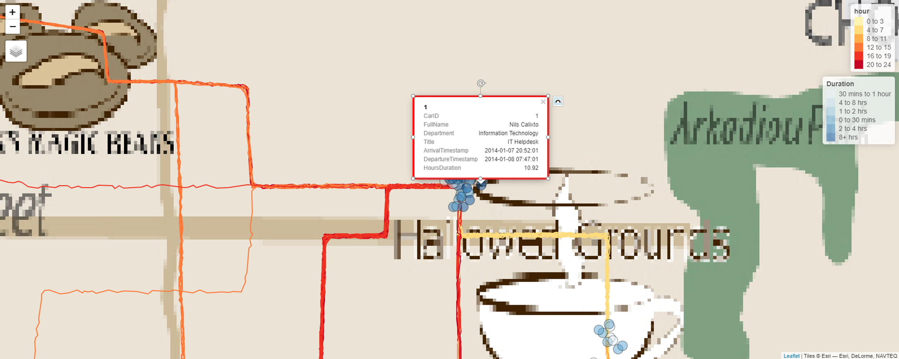

```{r setup, include=FALSE}

set.seed(1234)

knitr::opts_chunk$set(
	eval = TRUE,
	echo = TRUE,
	fig.retina = 3,
	message = FALSE,
	warning = FALSE
)
```

## 1.0 Spending EDA

### 1.1 Credit Card Data

### 1.2 Loyalty Card Data

### 1.3 Credit Card + Loyalty Data

## 2.0 Patterns of Life Kinematics

### 2.1 GPS Movement

Use this tab to understand patterns of life: where people go, what time, and for how long.

The tab defaults to car ID 1, date range January 6, 2014 - January 19, 2014, and 0:00 to 24:00 hours.

1) Select the car ID(s), date range, and time you want to explore.
{width=100%}

2) Zoom in to see the POIs more closely. By zooming in, you can see the distribution of POIs (whether there's few or many) and the colors of the POIs which indicate duration become more distinct.

3) Hover over individual POIs to see details about the person, their arrival, departure, and time spent at that location.
{width=100%}

### 2.2 Owners Identification

Use this tab to identify the likely owners of each credit card.

1) There are several ways to start. We will walk through one approach that has worked well for us. First, filter for one credit card using the data table filter. Second, filter for a location using the data table filter. Locations that are less popular work best. The heatmap is useful for finding the best locations to use.

2) Use the date filter for the map to narrow down the POIs that match the date of the transaction from step 1. Use the lasso selection tool to select the POIs near the location from step 1.

3) Use the data table to filter for the credit card number from step 2.

### 2.3 Credit Card and Loyalty Card Matching

## 3.0 Relationship Networks

### 3.1 Organizational Chart

### 3.2 Spending Habits

### 3.3 Geospatial Movement