```{r setup, include=FALSE}

set.seed(1234)

knitr::opts_chunk$set(
	eval = TRUE,
	echo = TRUE,
	fig.retina = 3,
	message = FALSE,
	warning = FALSE
)
```

## 1.0 Spending EDA

### 1.1 Credit Card Data

Use this tab to explore credit card data.

1. Start by selecting a date range for the transactions. Then, select a bar from the bar chart. Doing so will modify the Credit Cards by Locations heatmap as well as the Transaction Values for Selected Location boxplot.
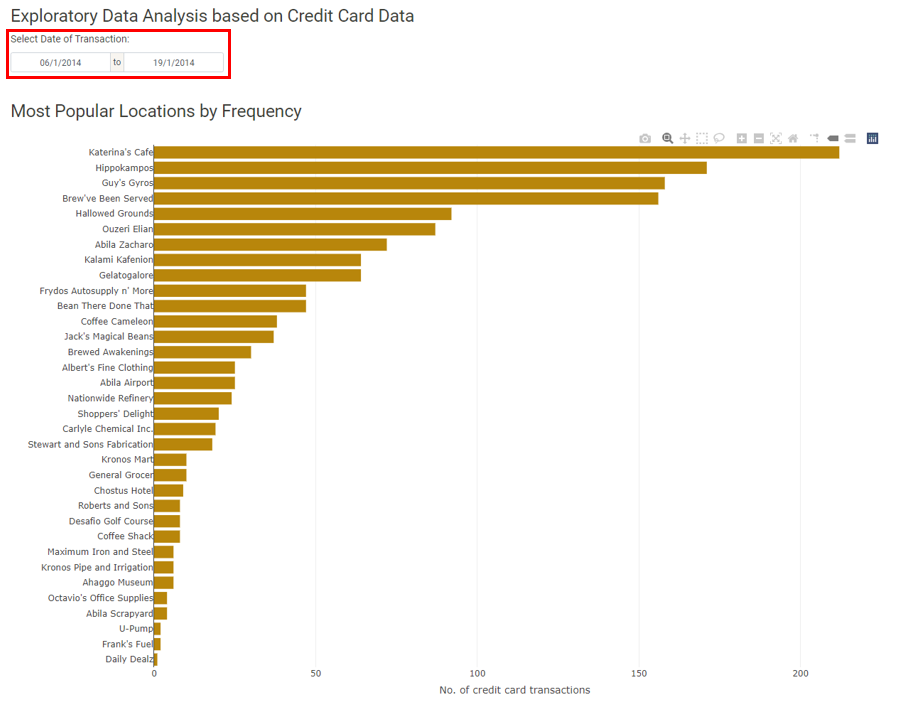{width=100%}

2. The Credit Cards by Locations heatmap will be filtered by the location chosen in step 1. Use the tooltip to explore the transactions in the heatmap.
{width=100%}
3. The Transaction Values for Selected Location boxplot will also be filtered by the location chosen in step 1. Check the boxplot for any suspicious transactions.
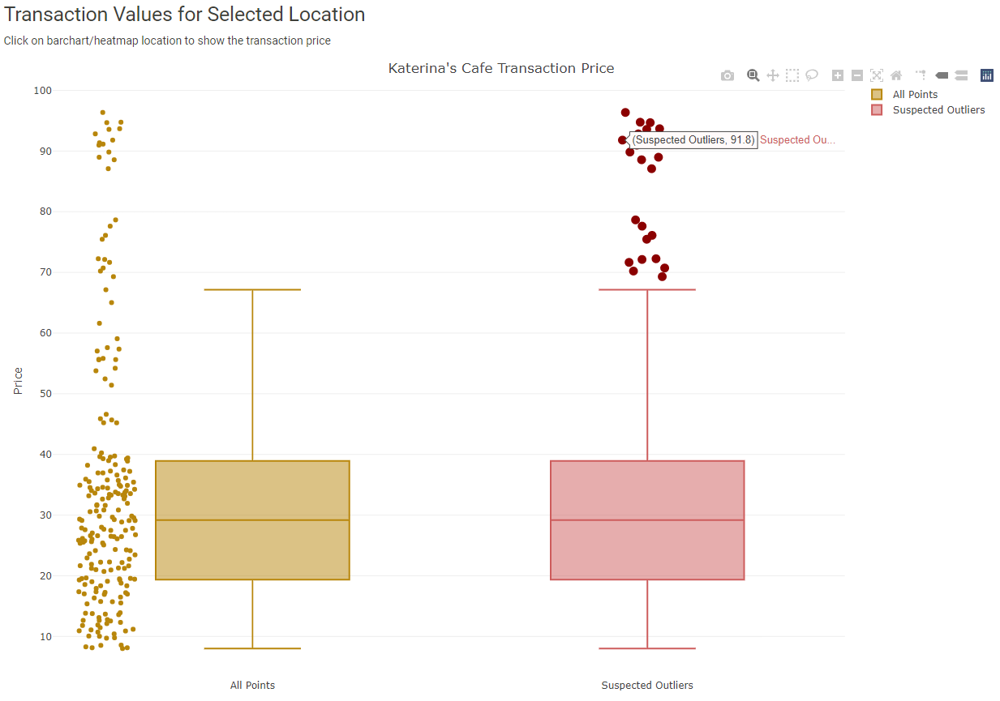{width=100%}

### 1.2 Loyalty Card Data

Use this tab to explore loyalty card data.

1. Start by selecting a date range for the transactions. Then, select a bar from the bar chart. Doing so will modify the Loyalty Cards by Locations heatmap.
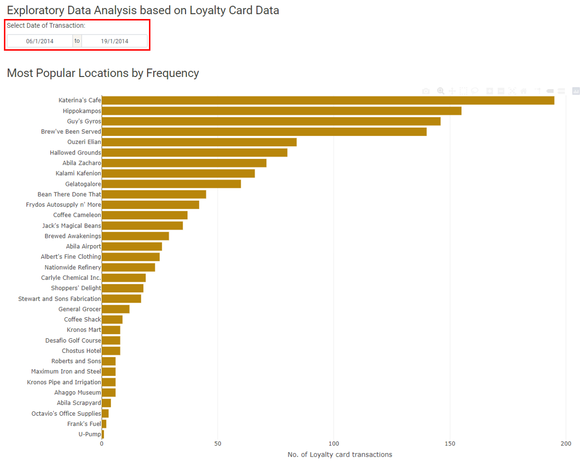{width=100%}

2. The Loyalty Cards by Locations heatmap will be filtered by the location chosen in step 1. Use the tooltip to explore the transactions in the heatmap.
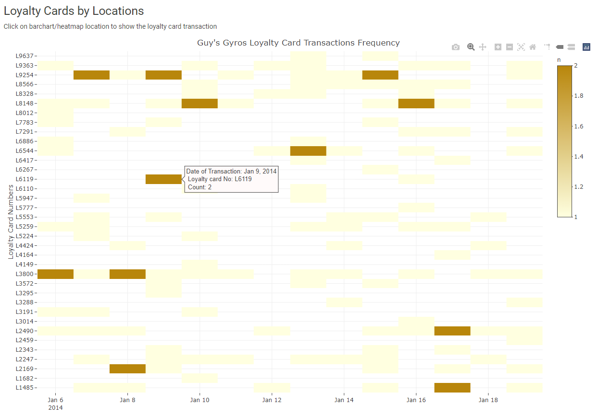{width=100%}

3. The Suspected Outliers for All Locations boxplot is not filtered by location. To see the details of the boxplot, use the zoom feature.
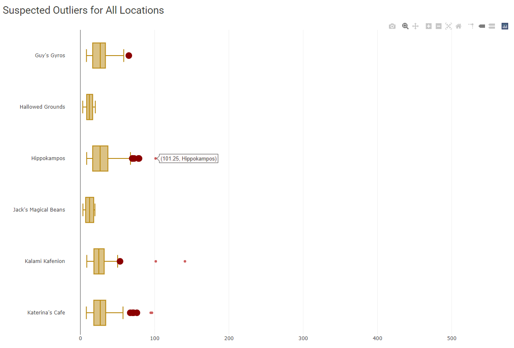{width=100%}

### 1.3 Credit Card + Loyalty Data

Use this tab to see locations and days where credit card and loyalty card transactions could not be matched to its corresponding loyalty card and credit card transaction.
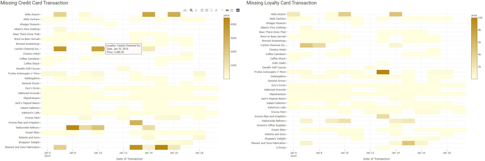{width=100%}

## 2.0 Patterns of Life Kinematics

### 2.1 GPS Movement

Use this tab to understand patterns of life: where people go, what time, and for how long.

The tab defaults to car ID 1, date range January 6, 2014 - January 19, 2014, and 0:00 to 24:00 hours.

1. Select the car ID(s), date range, and time you want to explore.
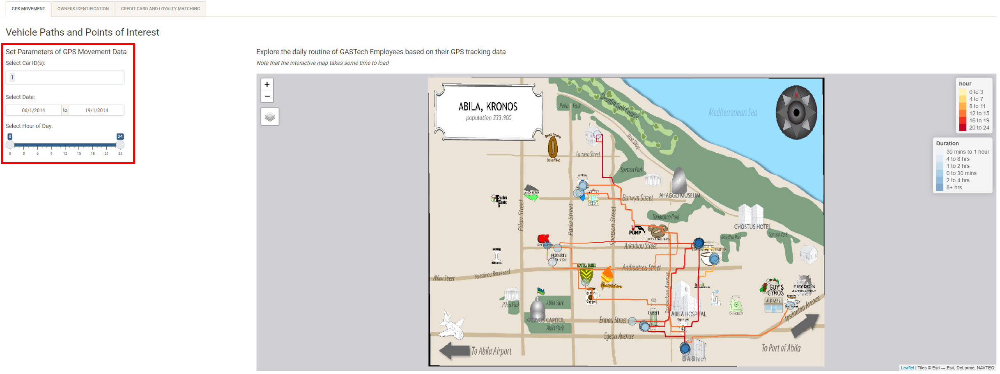{width=100%}

2. Zoom in to see the POIs more closely. By zooming in, you can see the distribution of POIs (whether there's few or many) and the colors of the POIs which indicate duration become more distinct.

3. Hover over individual POIs to see details about the person, their arrival, departure, and time spent at that location.
{width=100%}

### 2.2 Owners Identification

Use this tab to identify the likely owners of each credit card.

1. There are several ways to start. We will walk through one approach that has worked well for us. First, filter for one credit card using the data table filter. Second, filter for a location using the data table filter. Locations that are less popular work best. The heatmap is useful for finding the best locations to use.
{width=100%}

2. Use the date filter for the map to narrow down the POIs that match the date of the transaction from step 1. Use the lasso selection tool to select the POIs near the location from step 1. The data table on the right will surface the details of POIs selected.
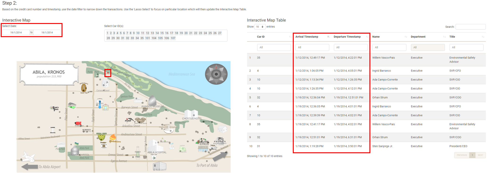{width=100%}

3. To match the credit card with the POI, compare the transaction time with the arrival and departure times. The transaction time should fall between the arrival and departure times. It is possible that multiple people meet this condition. They are candidates for possible owners of the credit card. To further narrow down the list of candidates, iterate through steps 1 and 2 using different transactions. The last candidate is the likely owner of the credit card.

4. The last step is to match the credit card with the loyalty card. Use the data table filter to filter for the credit card. The data table will show the loyalty card(s) that match based on a joined table using transaction details (date and price).
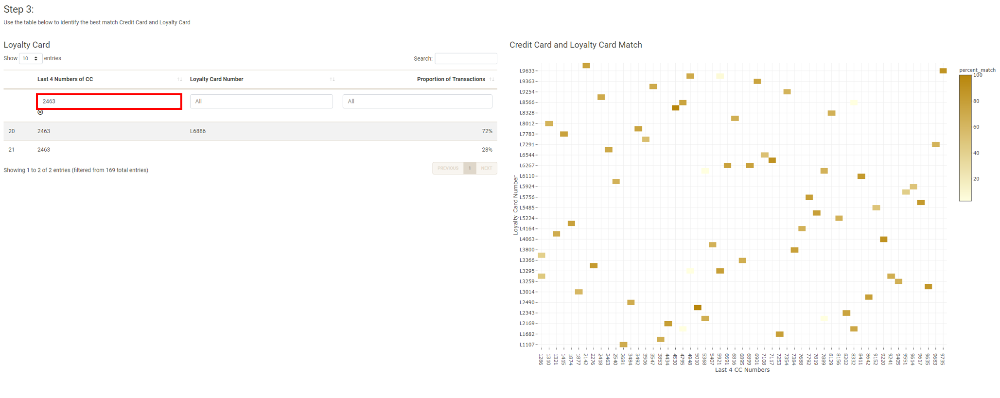{width=100%}

### 2.3 Credit Card and Loyalty Card Matching

This tab has the matching results from Owner Identification module.

## 3.0 Relationship Networks

### 3.1 Organizational Chart

Use this tab to explore the organizations and employees in GASTech.

1. Click on any node in the tree to expand it.
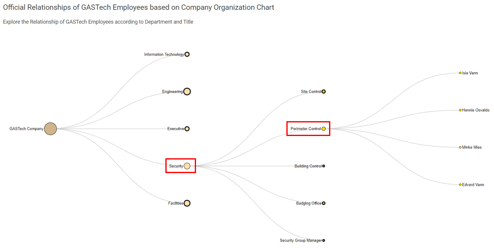{width=100%}

2. The table is interactive with the tree. To hide the table, click on the checkbox.
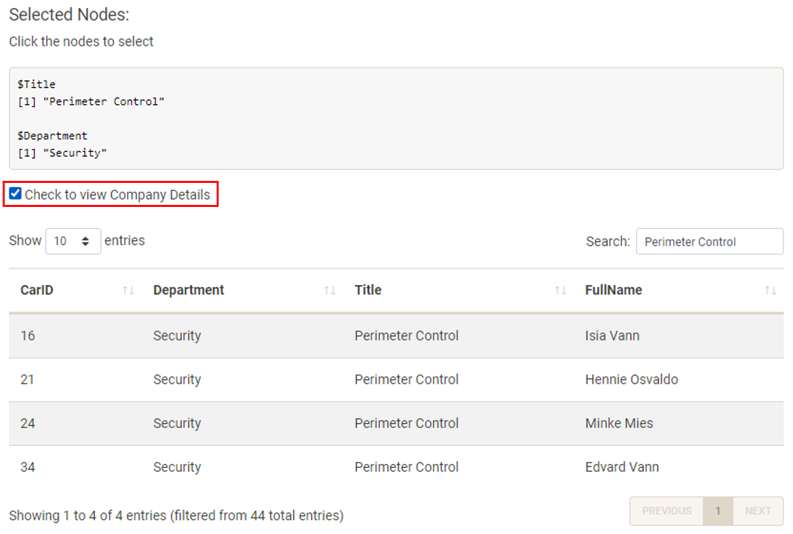{width=100%}

### 3.2 Spending Habits

Use this tab to explore unofficial relationships between GASTech employees.

1. There are several filters on this view: date, hour, day of week, and department. We recommend starting with the default filters to get a high level view and using the filters to hone in on specific relationships.
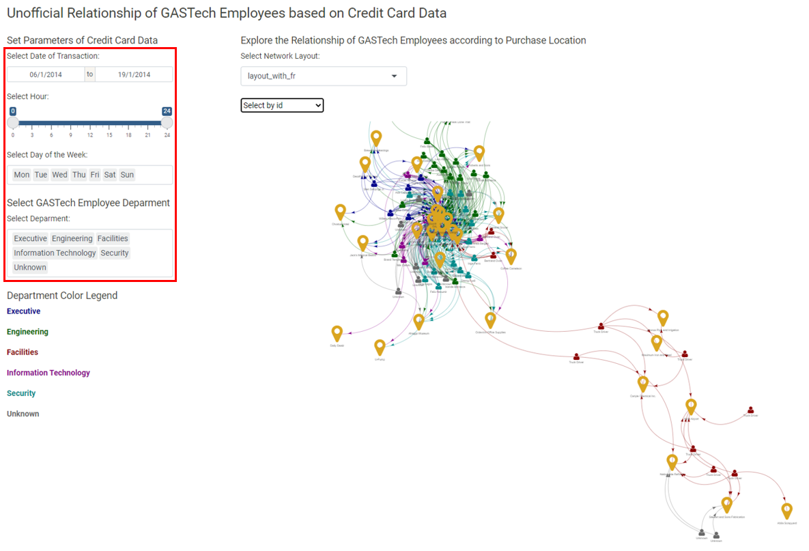{width=100%}

2. Select the network layout to use. Play around with this setting to see how your network is visualised. We recommend testing layout_with_fr and layout_nicely.
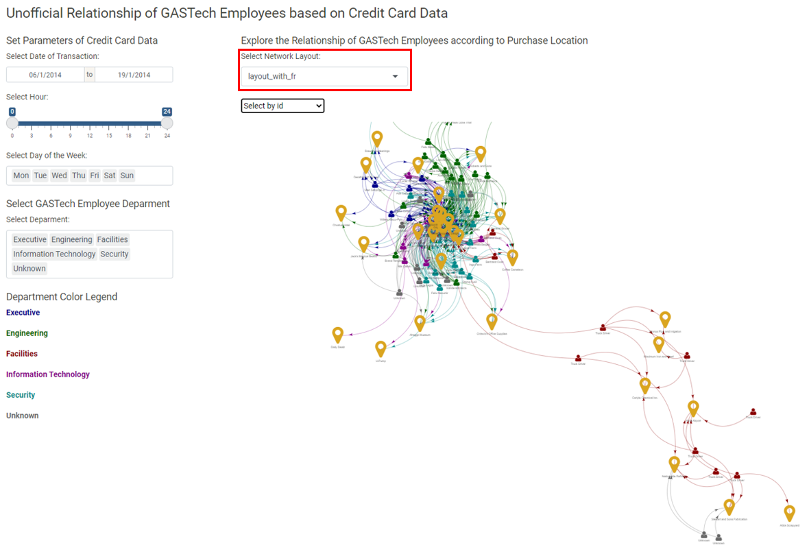{width=100%}

3. To interact with the network graph, use the select by id drop down or click on the network graph directly.
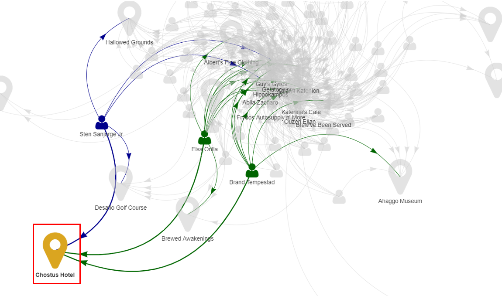{width=100%}

4. Interacting with the graph will generate a data table with details of the transactions that occurred at that location.
{width=100%}

```{r echo=FALSE, eval=FALSE}
library(pagedown)
pagedown::chrome_print("user_guide.html")
```