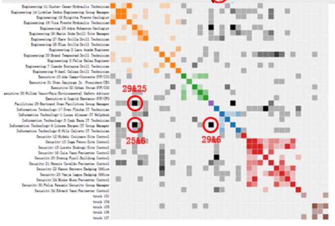
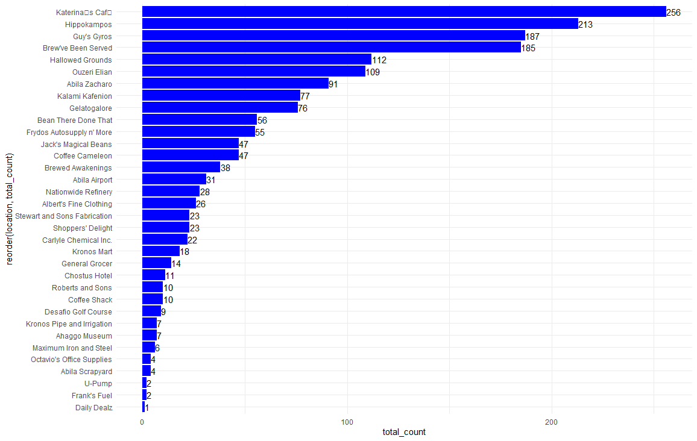
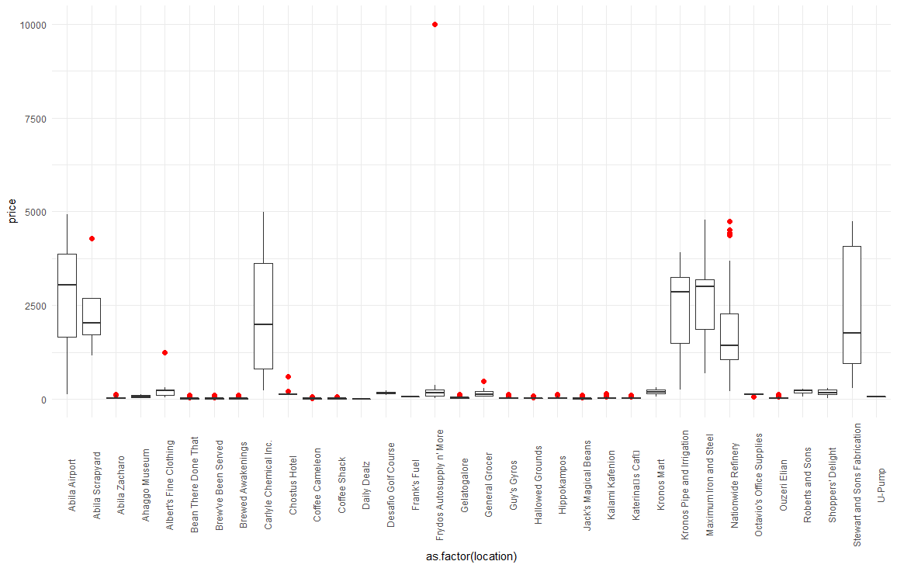
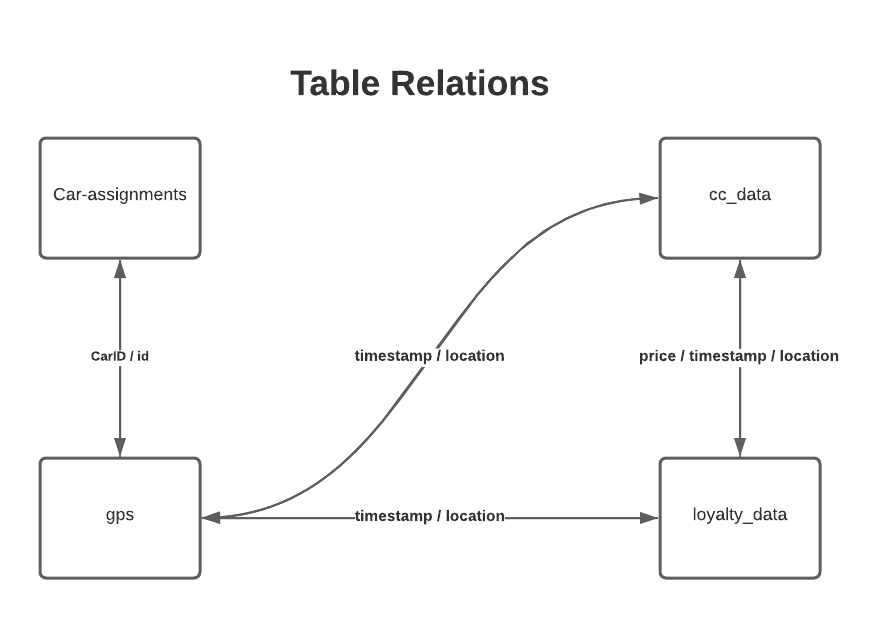
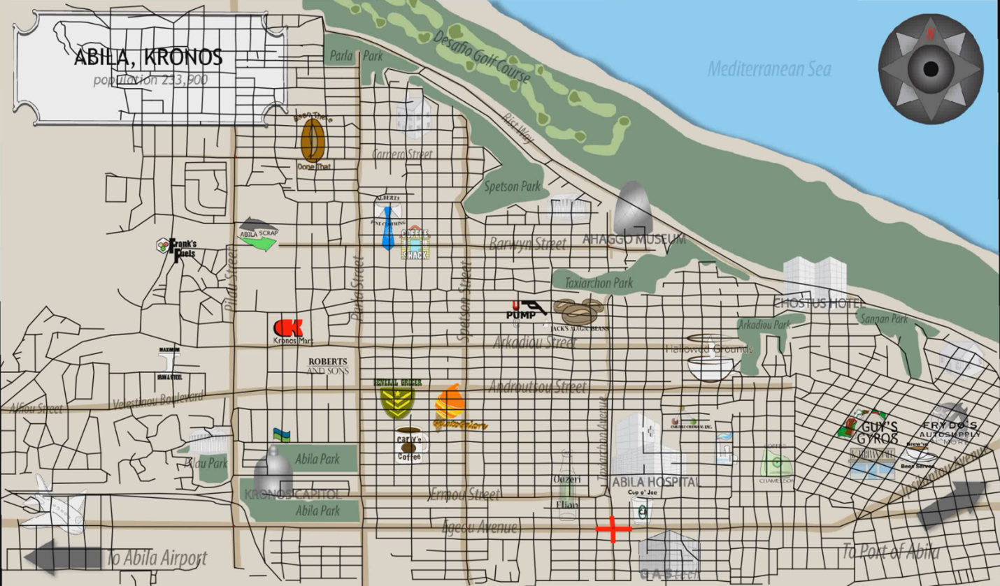

```{r setup, include=FALSE}
knitr::opts_chunk$set(echo = FALSE)
```

# Introduction

During 20-21 Jan 2014, on the island country of Kronos, several employees of GAStech, a Tethys gas multinational, go missing. Who is missing? Where have they gone? Were they kidnapped? If so, who is responsible?
To get to the bottom of this mystery, we will use visual analytic techniques to analyze data provided by GAStech to assist with law enforcement’s investigation and hopefully find the missing persons and bring them home safely. The data provided by GAStech covering the two weeks prior to the GAStech employees’ disappearance are as follows:

* Movement and tracking data from GAStech’s company cars which have GPS tracking,
* GAStech employee’s credit card transactions and Kronos Kares loyalty card data.

# Objective

The objective of this project is to use visual analytic techniques to surface and identify anomalies and suspicious behavior. More precisely, we aim to shed light on the following questions:

1. Using just the credit and loyalty card data, identify the most popular locations, and when they are popular. What anomalies do you see? What corrections would you recommend to correct these anomalies?

2. Add the vehicle data to your analysis of the credit and loyalty card data. How does your assessment of the anomalies in question 1 change based on this new data? What discrepancies between vehicle, credit, and loyalty card data do you find?

3. Can you infer the owners of each credit card and loyalty card? What is your evidence? Where are there uncertainties in your method? Where are there uncertainties in the data?

4. Given the data sources provided, identify potential informal or unofficial relationships among GASTech personnel. Provide evidence for these relationships.

5. Do you see evidence of suspicious activity? Identify 1- 10 locations where you believe the suspicious activity is occurring, and why.

# Literature Review
We reviewed the submissions for [VAST Challenge 2014](http://visualdata.wustl.edu/varepository/VAST Challenge 2014/challenges/MC2 - Patterns of Life Analysis/) for a better appreciation of approaches and techniques adopted to solved Mini-Challenge 2. We summarise below useful methodologies we wish to consider for our project.

The DAC-MC2 team from Virginia Tech used a methodology called Points of Interest (“POI”) to identify POIs such as people’s homes, their work places, and recreational locations (e.g. restaurants, cafes). A location is considered a POI if the time spent at a location is more than 5 minutes and the location has a diameter of less than 50 meters. They then graphed the distribution of POI over time for various days (weekdays and weekends) and locations (i.e. home, work, recreation).

Similarly, the MiddlesexMASS-Attfield-MC2 team from Middlesex used the Patterns of Life (“POL”) suite to create a map showing where each person was at any given time and for how long. They also overlayed credit card and loyalty transactions over their map.

To better understand the credit card and loyalty card data, the IIITH-YASHASWI-MC2 team from the International Institute of Information Technology Hyderabad visualized the distributions of credit card transactions by date and by person and employment title / employee title. This analysis enabled them to better understand typical patterns and identify transactions that deviated and stood out.

The Purdue-Guo-MC2 team from Purdue University created a Social Relationship Matrix, which involves plotting a heatmap of the number of times GAStech employees meet each other over the course of the two weeks. The assumption is that the more frequent people meet, the closer relationship they have between them.

# Approach

**Question#** | **Objective** | **Proposed Approach**
----|------------|--------------------
Q1 | Using just the credit and loyalty card data, **identify the most popular locations, and when they are popular**. What anomalies do you see? What corrections would you **recommend to correct these anomalies?** | To determine the most popular locations, we will create a heatmap visualization where the rows and columns represent time and location, respectively. The color of a cell will indicate the count of all transactions (popularity). The darker cells identify the locations that are most popular and when. <br>To detect the anomalies, we will use the plot_anomaly_diagnostics() function of timetk package to identify outliers from the credit card and loyalty card transactions. <br>We plan to retain all anomalies detected until we have made a thorough investigation and considered all the data provided.
Q2 | Add the vehicle data to your analysis of the credit and loyalty card data. How does your assessment of the anomalies in question 1 change based on this new data? What **discrepancies between vehicle, credit, and loyalty card data** do you find? | We assume that only the assigned driver will always drive the car to get from one location to another. <br>We will adapt the POI methodology to identify homes, workplaces and recreational locations. <br>To further assess the anomalies identified in question 1, we will create a heatmap for each location of: <br>* No. of credit card or loyalty card transactions, and <br>* No. of vehicle IDs passing through. <br>We may focus on unsuspecting POIs (e.g. homes) and analyse vehicle IDs that pass through those POIs.
Q3 | Can you infer the **owners of each credit card and loyalty card?** What is your evidence? Where are there uncertainties in your method? Where are there uncertainties in the data? | Leveraging on the POI methodology outlined in Question 2, we will cross-reference location and credit card activity to identify owners of credit card and loyalty card. <br>To infer the owners of each card, we will develop a word cloud of GAStech employee names associated with a credit card and loyalty card combination. The employee name that is the largest suggests a higher co-occurrence of the credit card and loyalty card being associated with that employee. <br>For the above proposed approaches, we recognise that the driver of the car might be different than the assigned name, the person making the credit card/loyalty card transactions could be different from the driver, etc.
Q4 | Given the data sources provided, **identify potential informal or unofficial relationships among GASTech personnel**. Provide evidence for these relationships. | To identify relationships, we will plot a heatmap of all GAStech employees versus GAStech employees as a social relationship matrix. Each cell represents the number of times they meet. The more often they meet, the darker the color of the cell. The names of the employees may be color-coded by their departments for us to analyse any suspicious inter-department relationships. <br>{width=80%}<br>Source: Purdue-Guo-MC2 team from Purdue University <br>* To classify an identified relationship as official or unofficial, we will analyse whether: <br>* The meetings occur during working hours <br>* The persons meeting work for the same department
Q5 | Do you see **evidence of suspicious activity? Identify 1- 10 locations** where you believe the suspicious activity is occurring, and why. | To mark on the Abila, Kronos map the identified locations of suspicious activities, based on our analyses performed for Questions 1 to 5. We will make the map interactive by including “tooltips” so when a user hovers over a location, a prompt will appear with a description of when the suspicious activity occurred and the persons involved.

# Data Preparation

GAStech provided four datasets/tables for our analysis (see Table 1).

**Dataset** | **Field name** | **Remarks**
----------|----------|--------------------
cc_data.csv|timestamp |By date-hour-minute
cc_data.csv|location	|name of the business
cc_data.csv|price	|real
cc_data.csv|Last4ccnum	Last 4 digits of the credit or debit card number
loyalty_data.csv|	timestamp	|By date
loyalty_data.csv|	location	|name of the business
loyalty_data.csv|	price	|real
loyalty_data.csv|	loyaltynum	|A 5-character code starting with L that is unique for each card
gps.csv|	timestamp	|By date-hour-minute
gps.csv|	id	|integer
gps.csv|	lat	|latitude
gps.csv| long	|longitude
gps.csv|	location	|Calculated field based on lat and long
car-assignments.csv|	LastName	|
car-assignments.csv|	FirstName	|
car-assignments.csv|	CarID	|integer
car-assignments.csv|	CurrentEmploymentType	|Department; categorical
car-assignments.csv|	CurrentEmploymentTitle	|job title; categorical
_Table 1:  Metadata for credit card transactions, loyalty card transactions, GPS tracking and car assignments._

We have performed preliminary exploratory data analysis (EDA) on credit card transactions (see Figure 1) and observed that Katerina’s Café conducts significantly more transactions than other locations, suggesting that it is very popular among GAStech employees.


_Figure 1: Frequency count of transactions by location_

Our EDA on boxplots of transaction prices by location revealed some outliers in transactions for several merchants, particularly Frydos Autosupply (see Figure 2), that warrants further investigation.


_Figure 2: Boxplot of transaction prices by location_

We will join the tables together to try to paint a more holistic picture of the events that occurred and answer the questions above. Figure 3 shows how the tables will be joined.


_Figure 3: Table relations for car-assignments, gps, cc_data, and loyalty data._

The cc_data and loyalty_data tables do not have explicit keys to use for joining, but the tables do have price and timestamp which may be sufficient proxies to bring the data together. However, the loyalty card timestamp is by date only whereas the credit card transactions timestamp is by date-hour-minute. Therefore, we make two underlying assumptions for joining these tables. First, there are no two transactions with the exact same price and timestamp values. Second, the timestamps from the cc_data and loyalty_data tables match.

We will also join all four tables together: cc_data, loyalty_data, gps tables, and car-assignments. As there are no obvious keys to join these tables together, we propose to create a calculated field in the gps table called “location” using the latitude and longitude coordinates. We will use this new “location” field together with timestamp to join car-assignments and gps with cc_data and loyalty_data.

Apart from the data in these four tables, we also have a map of Abila, Kronos (MC2-tourist.jpg). However, the map does not have coordinates. To plot the vehicle tracking GPS data onto the map, we will use the shapefiles for Abila, Kronos to geo-reference the map.


_Figure 4: Map of Abila, Kronos geo-referenced with streets_

# Technology

For geo-referencing, we will use an open-source geographic information system called QGIS.

The primary technology we will use for our investigation and analysis is the programming language R. We will explore various R packages to determine the best visualization of the GPS data (see below for a preliminary list). We may use Tableau to facilitate our preliminary visualization before determining R packages with the right balance between insights and ease of use to the reader.

* Sf package for vector data handling
* Raster package for raster data handling
* Star package for spatio-temporal data handling
* Tmap package for thematic maps to visualize spatial data distribution including choropleths and bubble maps
* RShiny for the creation R Shiny interfaces
* shinyWidgets for the customization of input widgets of the Shiny App
* tidyverse including its collection of R packages for performing various data analysis 
* plotly for the creation of interactive graphics and cahrtes
* rgdal for the binding of Geopstatial Data Abstraction Library
* Timetk for the visualization, wrangling and feature engineering of time series data

# Deliverables

The output from the project will be:

1. An interactive R Shiny dashboard for law enforcement to leverage as part of their investigation. The dashboard will come with a user guide that shows the law enforcement how to use the data visualisation functions designed.

2. A poster showcasing the key visuals of interest and summarizing the key insights from the project.

3. A detailed report detailing the approach and discussing the findings from the project

# Team Members

* [Archie Quiambao DOLIT](https://www.linkedin.com/in/adolit/)
* [Kevin Magic Rialubin SUNGA](https://www.linkedin.com/in/kevin-sunga/)
* [Nurulasyiqah Mohammad TAHA](https://www.linkedin.com/in/nurulasyiqah-md-taha/)